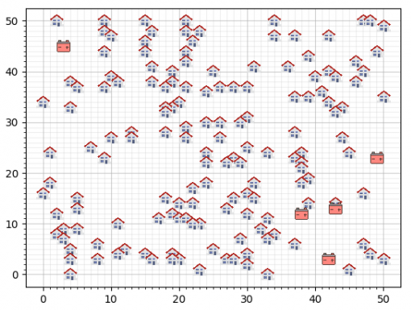

# Sunny_storage

*The project SmartGrid is conducted for the course 'Programming theory/Heuristics' for the Minor Programming (2019) at the University of Amsterdam.*

<br></br>
If we still want our lamp to work at night and our phones charged in 100 years, some things have to change in this world. Primary energy sources are running out, so we have to look at alternative energy sources. Green energy is the energy of the future. This is energy produced from inexhaustible sources, like wind or sun. It sounds good, however there are 'buts'. Sometimes solar panels (fortunately!) produce too many energy for their household. Ideally, the energy is transferred back to energy suppliers. Unfortunately, the infrastructure (the grid) is not designed for that. In our case, to still be able to use this energy, we use batteries.

To test if we can actually make a 'smart grid', we use different neighborhoods for this project. We have 3 standard neighborhoods, which all have 150 houses and 5 batteries. Since we have to connect the houses to the batteries, we are working with a state space of 5\exp150 = 7E104. So, a lot of possibilities to connect the houses! We generated our own neighborhoods with less houses and batteries to reduce the state space and test our algorithms. The images of the standard neighborhoods can be found in the folder 'Data'. An example of the first neighborhood:

**Neighborhood 1**



So, we have a lot of possibilities to connect houses with batteries. However, we also have limitations. Firstly, all of the houses have solar panels that generate a maximum output. Secondly, all of the batteries have a maximum capacity, which can not be exceeded when connecting houses to batteries. Lastly, the total costs have to be a low as possible. The costs are calculated as following:
* **Battery costs:** 5000 per battery (until SmartBatteryCompany helps us!)
* **Cable costs:** 9 per grid segment

Next to this houses can only be connected to 1 battery and not with each other.

The first part of the assignment is to connect all the houses with the batteries and take care of the limitations. We implemented the algorithms averagefit and decreasingfirstfit for this part. The second part is to calculate the total costs of the neighborhood and try to optimize that. We implemented breadth first search (bfs), branchnbound, greedy, hillclimber (base greedy or random), randclimber and random for this part. The third part is the total cost need to optimized by moving the batteries. We implemented battery_optimization for this. For the last part we get a little help from the SmartBatteryCompany! They have developed three new batteries with different capacities and prices. We can use as many as we want, but the goal is again to optimize the total cost.


| Battery type   |      Capacity      |  Price |
|----------|:-------------:|------:|
| Powerstar |  450 | 900 |
| Imerse-II |    900   |   1350 |
| Imerse-III | 1800 |    1800 |

We implemented Kmeansclustering for this part. Explanations about the algorithms can be found in the folder 'Algorithms'.
<br></br>

## Getting Started
### Prerequisites

The codebase is written in [Python3.6.3](https://www.python.org/downloads/). Packages can be found in requirements.txt. These packages are needed for running the code. Installing can via pip dmv, namely:

```
pip install -r requirements.txt
```
>> requirements nog maken :D

### Structure
* **Algorithms:** in this folder are all the scripts for programmed algorithms
* **Classes:** all needed classes are in this folder
    * We implemented classes for houses, batteries and the grid
    * All other classes are needed for the algorithms
* **Data:** all data of the neighborhoods is in this folder
    * For the standard neighborhoods there are also .png files
* **Findings:** in this folder are all the solved neighborhoods in .png files
* **Helper_algorithms:** in this folder are all the functions that we need to run for all algorithms
* **Output_Data:** in this folder are all the solved neighborhoods in .csv files and one overview .csv for all calculated prices for all run algorithms
* **Presentations:** all presentations for this course are saved here in .pptx and .pdf files


You can run the entire code by running main.py:

```
python main.py [number of the neigborhood]
```


### Authors
* Bart-Jan Akerboom
* Feline Benavides
* Jochem van den Hoek


### Acknowledgments
* StackOverFlow
* Minor Programming at the University of Amsterdam
